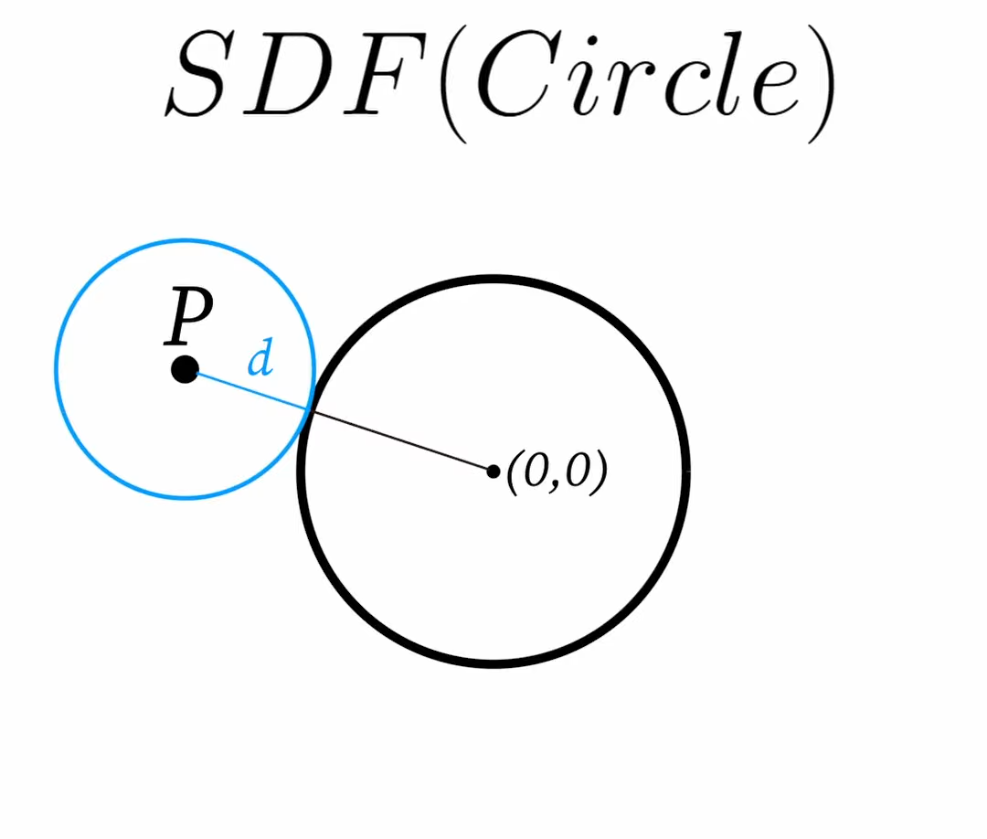
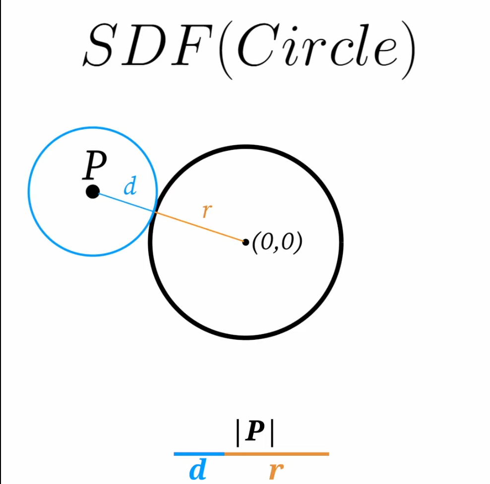
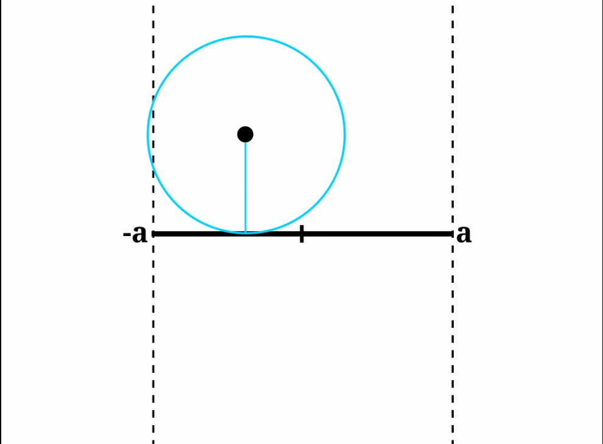
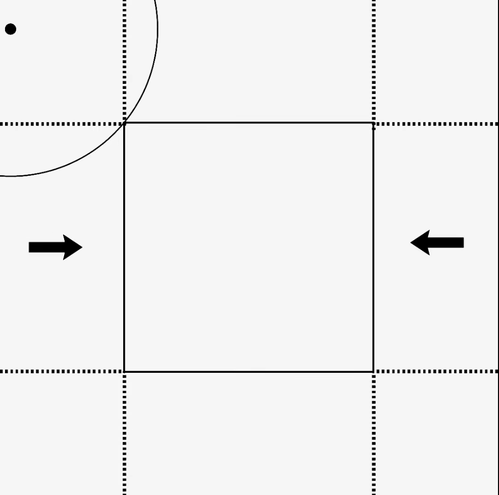

# SDF
A *SDF* tells you how far away you are from a shape at every single point.

On every point in a 2D plane or 3D space what is the minimum distance I need to travel to get to the surface of that shape.

We can think of a circle around a point representing the minimal radius or distance you need to travel to the surface.

## SDF of a circle
If we have a point in space, the most direct way to go towards the circle(the minimum distance) is going towards the origin of the shape, its direction and asking whats the distance along that direction we are going?

We take the magintude of the vector leading to our point.how far is it aways from the origin? Then we subtract the raidus of the circle. Now we only have the distance fragment

SDF of a circle (and a sphere) is the magnitude of the vector of the points minus the radius of the shape.
`d = |P| -r`
If we are inside the circle this evaluates to a negative distance.

## SDF of a line sigment

If you have a point tha is above or below a line we get the minimum distance of the point by traveling perpenticularly to the line.

SDF(Line) = |Py| inbetween -a and a

DONT UNDERSTAND

## Rectangle SDF

