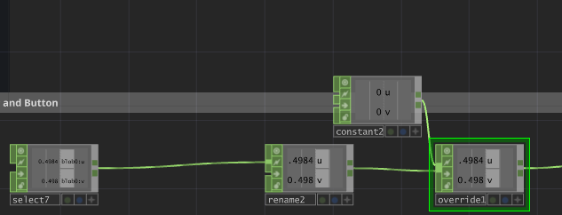

# 26-01-30
# TD
If you want to retrigger a trigger while the input of the trigger is 1 like for example when a person stands inside an triggering area of kinect 
you have to turn of time slicing for the triggerCHOP. And then in a chop execute you switch a state so trigger logic only gets executed when state 1 and not state 0

# TD
To assure you always have data use an overwrite with the same channels so if the blog tracking is bad you still have data there and no problems in td

